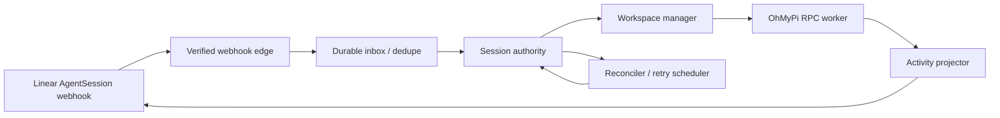

# OhMyPi Linear Gateway — Context Research

Research date: 2026-07-28

> **Read this first (2026-07-30):** the `agentSession.type` production bug (400 on every native webhook) was avoidable — the schema table in this dossier never listed `type` on the embedded webhook session payload. Treat this dossier + the pinned `@linear/sdk` types as the data-model contract; never invent fields, and check here before writing validators.

## Source baseline

| Source | Canonical repository / docs | Pinned revision |
|---|---|---|
| OhMyPi | https://github.com/can1357/oh-my-pi | `40509a4ae` (`main`, matches `origin/HEAD`) |
| Kata | https://github.com/gannonh/kata | `54393d2b` (`main`, matches `origin/HEAD`) |
| Kata Symphony mirror | https://github.com/gannonh/kata-symphony | `54393d2b` (`main`, matches `origin/HEAD`) |
| OpenAI Symphony | https://github.com/openai/symphony | `f8e8b8a` (`main`, matches `origin/HEAD`) |
| Linear Weather Bot | https://github.com/linear/weather-bot | `2edbbe419` (`main`, matches `origin/HEAD`) |
| Linear Developers | https://linear.app/developers | 29 developer pages crawled on 2026-07-28 |

## Research limits and evidence labels

> **Prominent limitation:** all three intended delegated source audits failed with `resource_exhausted`. No independent deep-source pass completed. I replaced those passes with one manual, primary-source audit; this report therefore has direct source grounding but not the originally intended independent cross-check. A correction-time scout retry also failed with `resource_exhausted`, so the corrections below remain manually verified rather than independently reviewed.

The Linear crawl retrieved all 29 pages mapped under `/developers`; “retrieved” does not mean every line received equal scrutiny. I closely read the agent, Agent Interaction, signals, OAuth, webhook, GraphQL, pagination/filtering, rate-limit, error, and reliability material. The remaining mapped pages received coverage-level review for relevance and constraints. Code claims come from the pinned source trees and cite concrete files and line ranges.

Labels are deliberate:

- **Observed** — behavior or schema read directly from pinned source, checked-in schema, or first-party documentation.
- **Decision** — the recommended gateway design.
- **[INFERENCE]** — a recommendation derived from observed constraints but not required or implemented by an upstream source.

The requested “simphony” is interpreted as OpenAI Symphony. `gannonh/kata-symphony` is included because it is directly relevant prior art, not as a replacement.

## Decision: proposed gateway architecture [INFERENCE]

Build a webhook-first, multi-tenant Linear app whose worker boundary is an OhMyPi RPC subprocess. Keep Symphony’s single-authority scheduler, deterministic workspace ownership, reconciliation, and bounded retry model. Do **not** copy Symphony’s polling-only Linear integration or API-key authentication: Linear’s native Agent Session APIs now provide the correct assignment, conversation, cancellation, progress, and identity model.

**Decision:** split the gateway into four deep modules. This module boundary is proposed here; it is not a Linear, OhMyPi, Kata, or Symphony requirement:

1. **Linear edge** — OAuth installation, token rotation, webhook verification/deduplication, GraphQL/SDK calls.
2. **Session authority** — durable mapping of one Linear `AgentSession` to one gateway run and one OhMyPi session; the only writer of run state.
3. **Workspace/worker runtime** — deterministic isolated workspace plus supervised `omp --mode rpc` subprocess.
4. **Activity projector** — converts OhMyPi lifecycle/tool events into rate-limited Linear Agent Activities, plans, external URLs, and terminal responses.

## What Linear requires

### Identity and assignment

Linear agent APIs are a Developer Preview and may change. An agent is installed with standard OAuth plus `actor=app`; installation requires a workspace admin. Request `app:assignable` to appear as an issue delegate and `app:mentionable` to receive mentions. Delegation uses `Issue.delegate`, not `Issue.assignee`, preserving human ownership. Each installation has a workspace-specific app-user ID returned by `viewer.id`; store it beside the installation token. `actor=app` cannot also request `admin` scope.

Sources: [Agents](https://linear.app/developers/agents), [OAuth](https://linear.app/developers/oauth-2-0-authentication), [OAuth actor authorization](https://linear.app/developers/oauth-actor-authorization).

**[INFERENCE] Recommended v1 scopes:** `read`, `write`, `app:assignable`, `app:mentionable`. Avoid `admin`, customer, and initiative scopes until a concrete feature needs them.

### Native session lifecycle

Linear automatically creates an `AgentSession` when the app is mentioned or delegated an issue. Visible states are `pending`, `active`, `error`, `awaitingInput`, `complete`, and `stale`; Linear derives state from the most recent activity, so the gateway must not invent a parallel user-facing state machine.

Subscribe to `AgentSessionEvent`:

- `created`: start a new run using `promptContext` plus structured issue/comment/guidance fields.
- `prompted`: append `agentActivity.body` to the existing OhMyPi session and resume/steer it.

The webhook must return within 5 seconds. A new session must receive a `thought` activity or an `externalUrls` update within 10 seconds or Linear marks it unresponsive. Subsequent silence becomes stale after 30 minutes, but a new activity recovers it.

Source: [Developing the Agent Interaction](https://linear.app/developers/agent-interaction), [Interaction Best Practices](https://linear.app/developers/agent-best-practices).

### Activities, plans, and user input

**[INFERENCE] Projection mapping:** project OhMyPi events into Linear’s five agent-authored activity types:

| OhMyPi event | Linear activity |
|---|---|
| accepted/start/turn start | ephemeral `thought` |
| tool start/update/end | ephemeral or completed `action` |
| ask/clarification | `elicitation` |
| final assistant result | `response` |
| terminal worker failure | `error` |

**Observed:** a user-authored `prompt` activity cannot be emitted by the agent. Plans are full-array replacements with `pending`, `inProgress`, `completed`, or `canceled` items.

**[INFERENCE]** Treat Agent Activities—not editable comments—as the canonical conversation log when reconstructing a session; debounce plan updates and persist the last projected version. Use `signal: select` for bounded choices such as repository selection and `signal: auth` for account linking. Treat a human `stop` signal as an immediate cancellation barrier: stop further tools/API mutations, abort the OhMyPi run, then emit one terminal `response` or `error` confirming the stop.

Sources: [Agent Interaction](https://linear.app/developers/agent-interaction), [Signals](https://linear.app/developers/agent-signals), [AIG](https://linear.app/developers/aig).

### Webhook and OAuth correctness

Verify the HMAC-SHA256 signature over the **raw** request body with timing-safe comparison; reject timestamps outside a one-minute replay window. Deduplicate on `Linear-Delivery`/`webhookId` before enqueueing. Acknowledge only after durable enqueue, always within 5 seconds. Linear retries failed deliveries after 1 minute, 1 hour, and 6 hours, at most three retries.

OAuth access tokens last 24 hours and refresh tokens rotate. Refresh requests have a 30-minute replay grace period for network-loss recovery. Encrypt tokens at rest, serialize refresh per installation, and atomically replace the token pair. Handle `OAuthApp revoked` and `PermissionChange` webhooks by disabling dispatch immediately and canceling runs that lost access.

Sources: [Webhooks](https://linear.app/developers/webhooks), [SDK webhook helper](https://linear.app/developers/sdk-webhooks), [OAuth](https://linear.app/developers/oauth-2-0-authentication).

### API usage constraints

Prefer webhooks over polling. Use cursor pagination and server-side GraphQL filters. Treat GraphQL HTTP 200 responses as potentially partial: inspect `errors` before accepting data. Rate limits are workspace/user/request-complexity sensitive; schedule API calls through a per-installation limiter and honor response headers rather than hard-coding one global quota.

Sources: [GraphQL](https://linear.app/developers/graphql), [Pagination](https://linear.app/developers/pagination), [Filtering](https://linear.app/developers/filtering), [Rate limiting](https://linear.app/developers/rate-limiting), [Errors](https://linear.app/developers/sdk-errors).

### Preview API compatibility

The checked-in Linear SDK schema and the public guide are already slightly out of phase: session query results expose `externalLinks`, while the create/update inputs still name the write field `externalUrls`; the old query-side `externalUrls` field is deprecated. Isolate this vocabulary mismatch inside the Linear adapter rather than leaking either name into the gateway domain. Contract-test the exact pinned SDK operations against a development workspace, because the agent API is explicitly a Developer Preview.

Source: Linear SDK `packages/sdk/src/schema.graphql:647-657`, `785-817`, `885-911`, `995-1041`.

### Exact checked-in Agent Session schema

**Observed in Linear SDK `schema.graphql`:**

| Surface | Exact relevant shape |
|---|---|
| `AgentSessionStatus` | Non-null session field; enum values `pending`, `active`, `awaitingInput`, `complete`, `error`, `stale`. |
| `AgentSession` identity/context | Non-null `id`, `slugId`, `appUser`, `context`, `status`, `externalLinks`, `createdAt`, `updatedAt`; nullable `creator`, `issue`, `comment`, `sourceComment`, `pullRequest`, `plan`, `summary`, `startedAt`, `endedAt`, `dismissedAt`, `url`, `sourceMetadata`, `workspaceDiff`. |
| `AgentSession.activities` | Non-null paginated connection; supports `after`, `before`, `first`, `last`, `includeArchived`, `orderBy`, and `AgentActivityFilter`. |
| `AgentSessionCreateInput` | Required `appUserId`; optional `issueId`, `id`, internal `context`. Issue creation variant requires `issueId`; comment variant requires `commentId`. |
| `AgentSessionUpdateInput` | Optional `plan`, `externalUrls`, `addedExternalUrls`, `removedExternalUrls`, deprecated `externalLink`; it does not expose a public status setter. |
| `AgentActivity` | Non-null `id`, `agentSession`, `content`, `user`, `createdAt`, `updatedAt`, `ephemeral`, `queued`; nullable `archivedAt`, `signal`, `signalMetadata`, `sourceComment`, `sourceMetadata`, `contextualMetadata`, `sentAt`. |
| `AgentActivityCreateInput` | Required `agentSessionId` and untyped `JSONObject content`; optional `id`, `ephemeral`, `signal`, `signalMetadata`, `contextualMetadata`. |
| Activity content union | `action`, `elicitation`, `error`, `prompt`, `response`, `thought`. Action requires `action`, `parameter`, `type`; body-based agent outputs require non-null `body` and `type`. |
| `AgentActivitySignal` | `auth`, `continue`, `select`, `stop`. |
| `AgentSessionEventWebhookPayload` GraphQL | Non-null `action`, `agentSession`, `appUserId`, `organizationId`, `oauthClientId`, `type`, `webhookId`, `webhookTimestamp`, `createdAt`; nullable `agentActivity`, `guidance`, `previousComments`, `promptContext`. `guidance` is a nullable list whose present elements are non-null. |
| Embedded `AgentSessionWebhookPayload` | Non-null string fields `appUserId`, `createdAt`, `id`, `organizationId`, `status`, `type`, `updatedAt`; nullable `archivedAt`, comment/creator/issue objects and IDs, `endedAt`, `sourceCommentId`, `sourceMetadata`, `startedAt`, `summary`, `url`. Its webhook `status` is `String!`, not `AgentSessionStatus!`. |
| Generated webhook SDK type | Narrows top-level `type` to literal `"AgentSessionEvent"`. Generated fields use `Maybe`/optional properties for `agentActivity`, `guidance`, `previousComments`, and `promptContext`, matching the GraphQL fields’ nullable list/object/string wrappers. |

The webhook payload embeds an `AgentSessionWebhookPayload`, not the full query type. Code must branch on webhook `action` and nullable SDK properties rather than assuming a creation payload. The schema’s query/write naming is transitional: query-side `externalLinks` is current, query-side `externalUrls` is deprecated, while mutation inputs still write `externalUrls`.

Sources: Linear SDK `packages/sdk/src/schema.graphql:112-255`, `303-495`, `569-817`, `827-911`, `913-1143`; `packages/sdk/src/_generated_documents.ts:533-719`; `packages/sdk/src/webhooks/types.ts:297-302`.

### Official Weather Bot runtime trace

**Observed:** Linear presents Weather Bot as its agent-integration example. Its request path is:

1. `/oauth/authorize` requests `read,write,app:assignable,app:mentionable` with `actor=app`.
2. `/oauth/callback` exchanges the code, queries the workspace, and stores access token, rotating refresh token, and expiry in Cloudflare KV under the workspace ID.
3. `/webhook` checks required configuration, constructs `LinearWebhookClient`, registers an `AgentSessionEvent` listener, and calls the generated handler.
4. The listener retrieves the token by `organizationId`, builds a prompt from issue title/comment, and calls `AgentClient.handleUserPrompt`.
5. `AgentClient` reconstructs prior activities, loops over OpenAI responses, emits typed `thought`/`action`/`response`/`elicitation`/`error` activities, executes demo tools, and posts action results.

This proves the app-actor OAuth shape, organization-keyed token lookup, rotating refresh storage, SDK webhook dispatch, activity reconstruction, and typed `createAgentActivity` payloads.

**[INFERENCE] Production changes required:** the demo awaits the complete model/tool loop before the webhook response despite receiving a Cloudflare `ExecutionContext`, risking Linear’s five-second deadline. It lacks durable enqueue/deduplication, serialized refresh, run ownership, action/signal handling, `promptContext`/guidance use, worker restart recovery, and an OAuth `state` round trip. A production gateway should acknowledge after durable intake, bind a single-use expiring OAuth state to the install attempt, and move execution behind a durable session authority.

Sources: Weather Bot `src/index.ts:13-121`, `src/lib/oauth.ts:21-123`, `132-200`, `239-262`, `src/lib/agent/agentClient.ts:29-112`.

## What to reuse from OhMyPi

### Decision: use OhMyPi RPC as the worker contract [INFERENCE]

OhMyPi RPC is newline-delimited JSON over stdio. It emits a `ready` frame, correlated command responses, and the full agent/session event stream. Protocol v2 adds validated chunking up to a 64 MiB reassembled frame; clients must correlate responses by `id`, not arrival order. See `docs/rpc.md:1-105`.

**Decision:** the gateway should use only this subset:

- start: `omp --mode rpc` with an explicit per-run cwd and controlled config;
- negotiate protocol v2;
- `prompt`, `steer`/`follow_up`, `abort`, `get_state`, paginated message reads;
- optionally `set_todos` to initialize the Linear plan and `set_host_tools` for narrowly scoped Linear operations;
- consume `agent_start/end`, `turn_start/end`, message, tool-execution, compaction, retry, and subagent events.

OhMyPi exposes stable state needed for recovery—`sessionFile`, `sessionId`, streaming/compaction flags, message count, todos, and context usage (`docs/rpc.md:232-275`)—and a rich event stream (`docs/rpc.md:379-393`). Host tools can be replaced atomically before the next model call (`docs/rpc.md:309-345`).

Implementation references: OhMyPi `packages/coding-agent/src/modes/rpc/rpc-types.ts:32-77`, `202-295`, `361-389`; `rpc-client.ts:104-123`, `548-568`; `rpc-mode.ts:307-330`, `480-483`; `rpc-frame.ts:190-307`.

### Observed OhMyPi runtime path

The source path is end to end, not only a protocol declaration:

1. `RpcClient.start()` spawns `bun <cli> --mode rpc` with the configured working directory and environment.
2. It reads newline-delimited stdout in the background, waits for `ready`, rejects early process/output failure, enforces a 30-second startup timeout, and negotiates protocol v2 when advertised.
3. The decoder reassembles v2 chunks before dispatch; response IDs resolve pending commands while agent/session event frames go to listeners.
4. `prompt()` only sends the command acknowledgment. Completion arrives later through streamed lifecycle events; `steer`, `followUp`, and `abort` are separate commands.
5. Startup failure kills and reaps the child and rejects pending host-tool calls; `stop()` kills the child, aborts the reader, and clears pending requests.

Sources: OhMyPi `packages/coding-agent/src/modes/rpc/rpc-client.ts:262-450`, `548-609`; `rpc-frame.ts:190-307`; `rpc-types.ts:32-77`, `202-295`.

### Decision: gateway-owned tools, not broad Linear credentials [INFERENCE]

**Decision:** inject narrow host tools such as `linear_get_issue`, `linear_update_issue`, `linear_create_comment`, `linear_update_session_urls`, and `linear_repository_suggestions`. These tool names and boundaries are proposed here, not supplied by OhMyPi or Linear. Keep OAuth tokens in the gateway; never expose them to the model, workspace, shell environment, or transcript. Validate tool input against the installation, team-access snapshot, session issue, and allowed mutation set.

**[INFERENCE]** Use OhMyPi’s explicit approval policy rather than assuming unattended execution is safe. Headless provider safety checks fail closed, and mutating tools need a deployment-specific policy (`docs/approval-mode.md:1-8`, `69-71`, `111-135`). Run each issue in a dedicated OS process and workspace; shell reuse is session-key isolated, but subprocess isolation is the clearer multi-tenant boundary (`docs/bash-tool-runtime.md:91-106`).

### Decision: cancellation and resumability mapping [INFERENCE]

**Decision:** map Linear `prompted` events to `steer` while streaming and `follow_up` while idle. Map `stop` to `abort`, then wait for an observed terminal event before releasing the workspace. Persist the OhMyPi `sessionFile` and resume it only for the same Linear installation/session/issue tuple. Never infer completion from the immediate `prompt` acknowledgment: completion is event-driven; local-only prompts may end through `prompt_result` without `agent_end` (`docs/rpc.md:99-105`, `208-230`).

## Observed prior art: Symphony and Kata

**Observed in OpenAI Symphony’s specification:**

- one authoritative orchestrator owns claims, dispatch, retries, and reconciliation (`SPEC.md:635-733`);
- bounded global and per-state concurrency with deterministic candidate ordering (`SPEC.md:733-840`);
- deterministic workspace paths and strict containment/symlink safety (`SPEC.md:851-949`);
- worker protocol separated from tracker adapter (`SPEC.md:950-1177`);
- small tracker read kernel rather than an ever-growing generic CRUD abstraction (`SPEC.md:1178-1322`);
- structured issue/session log context, snapshots, token accounting, and explicit failure classes (`SPEC.md:1358-1457`, `1633-1716`);
- secrets through environment indirection, never logs, with untrusted tracker content treated as hostile (`SPEC.md:1718-1797`).

### Observed OpenAI Symphony runtime path

The orchestrator process owns `running`, `claimed`, blocked, and retry-attempt state; schedules poll ticks; handles worker completion/down messages; and chooses continuation versus failure retry. Dispatch creates a validated per-issue workspace, runs creation hooks, starts one agent session, executes bounded turns, refreshes tracker state after each completed turn, and either continues with the refreshed issue or returns control to the orchestrator. Cleanup hooks run in `after`, so normal completion and failures share the cleanup path.

Sources: OpenAI Symphony `elixir/lib/symphony_elixir/orchestrator.ex:13-72`, `190-250`; `workspace.ex:2-50`; `agent_runner.ex:21-52`, `88-150`.

### Observed Kata runtime path

Kata’s Linear adapter implements the tracker read/write boundary: candidate fetch, state fetch, issue refresh, comment creation, and state update. Its orchestrator dispatches Codex or Pi session loops, sends refresh/steer inputs through channels, refreshes issue state between turns, terminates when tracker state leaves the active set, and distinguishes continuation retries from failure retries. This is implementation prior art for orchestration mechanics, not evidence for Linear’s newer native Agent Session semantics.

Sources: Kata `apps/symphony/src/linear/adapter.rs:14-44`; `apps/symphony/src/orchestrator.rs:531-647`, `649-855`, `1454-1649`.

**Decision — do not reuse these parts unchanged [INFERENCE]:**

- personal `LINEAR_API_KEY` authentication;
- project polling as the primary intake path;
- assignee filters as the agent ownership model;
- tracker statuses as the only session UX;
- in-memory-only claim/retry state;
- comments as the primary agent transcript.

Those predate or bypass Linear’s native agent actor, delegate, AgentSession, AgentActivity, and stop-signal contracts.

## Decision: proposed durable state model [INFERENCE]

This schema is proposed by this dossier; no upstream source defines it. Use a transactional database with these minimum records:

- `installation`: organization ID, app-user ID, encrypted access/refresh tokens, expiry, scopes, team-access snapshot, revoked timestamp.
- `webhook_delivery`: delivery ID, organization ID, received timestamp, payload hash, processing status; unique delivery ID.
- `agent_run`: Linear session ID (unique), issue ID, installation ID, gateway state, desired state, OhMyPi session ID/file, workspace path, attempt, lease owner/expiry, last activity timestamps, terminal reason.
- `run_input`: immutable ordered `created`/`prompted`/`stop` inputs keyed by Linear activity/delivery ID.
- `activity_projection`: source event key to Linear activity ID, payload hash, projection status; prevents duplicate progress after retries.
- `workspace`: canonical path, repository identity/ref, creation and cleanup state.

**Decision:** use internal implementation states `queued`, `starting`, `running`, `waiting`, `stopping`, `succeeded`, `failed`, `canceled`, `orphaned`. These are gateway-owned states, not Linear enums; Linear remains authoritative for the user-visible AgentSession status.

## Decision: proposed invariants [INFERENCE]

1. One Linear `AgentSession` maps to at most one live OhMyPi worker lease.
2. Webhook acknowledgment means “durably accepted,” never “work completed.”
3. Duplicate webhook delivery or process restart cannot duplicate a worker or Agent Activity.
4. A `stop` input dominates queued prompts and retries.
5. No model process receives Linear OAuth credentials.
6. Every filesystem path resolves beneath its run workspace; no symlink escape.
7. Terminal Linear activity is emitted once, only after the worker is terminal or definitively lost.
8. Permission loss/revocation prevents new calls before any further agent work.
9. Progress projection is lossy and rate-limited; terminal outcomes and user prompts are lossless.
10. Repository choice is explicit or confidence-backed through `issueRepositorySuggestions`; ambiguity becomes an elicitation, not a guess.

## Decision: proposed end-to-end flow [INFERENCE]

1. Verify and deduplicate webhook; persist input; return 200 within 5 seconds.
2. For `created`, immediately enqueue a `thought` projection and optionally set the dashboard `externalUrls`.
3. Acquire the unique session lease. Resolve installation permissions and repository. If ambiguous, emit a `select` elicitation and stop before workspace creation.
4. Create/reuse deterministic workspace; materialize repository at a pinned ref; construct prompt from `promptContext`, structured fields, and trusted gateway policy.
5. Spawn `omp --mode rpc`; negotiate v2; register narrow host tools; start/resume the bound session.
6. Project meaningful lifecycle/tool events with coalescing and backpressure. Persist every user input and terminal event before API projection.
7. On `prompted`, steer/follow up the same session. On `stop`, atomically set desired state to canceled, abort, and suppress further mutations.
8. Reconcile leases, OhMyPi process/session state, Linear permissions, and terminal projections on a fixed cadence. Retry transient failures with capped exponential backoff and jitter; never retry canceled/revoked runs.
9. On success, attach dashboard and PR URLs through `externalUrls`, emit one `response`, and retain the workspace/session according to policy. On failure, emit one actionable `error` with a correlation ID.

## Decision: recommended first implementation slice [INFERENCE]

Build this proposed narrow vertical path before adding a dashboard or multi-host scheduling:

1. OAuth `actor=app` installation with `app:assignable`/`app:mentionable`, encrypted rotating tokens, and revocation handling.
2. Verified/deduplicated `AgentSessionEvent` endpoint plus durable inbox.
3. Single-host session authority with database leases and deterministic local workspaces.
4. OhMyPi RPC supervisor: ready/negotiate/prompt/events/abort/resume.
5. Activity projector for `thought`, `action`, `elicitation`, `response`, `error`, plan, and `externalUrls`.
6. Stop-signal and prompted-session continuation paths.
7. Crash/restart reconciliation and a real Linear workspace integration profile.

Do not start with generic Linear CRUD, polling, a web dashboard, SSH workers, or arbitrary agent backends. They widen the surface without proving the load-bearing session bridge.

## Open design decisions [INFERENCE]

- Database and deployment topology: SQLite is adequate for one host; Postgres is the safer default for horizontal workers and lease correctness.
- Workspace source policy: configured repository map, Linear guidance, or a connected source-control installation.
- OhMyPi isolation tier: local process/user, container, or microVM. Multi-tenant hosted use should not share a Unix user with untrusted repositories.
- Human approval boundary for consequential Linear/source-control actions.
- Retention policy for prompts, model transcripts, workspaces, artifacts, and OAuth audit records.
- Developer Preview compatibility strategy: pin `@linear/sdk`, snapshot the GraphQL schema, and place all agent-preview calls behind one adapter with contract tests.

## Linear documentation coverage

Firecrawl successfully retrieved all 29 pages mapped beneath `/developers`. Close reading focused on agent APIs, Agent Interaction, Best Practices, Signals/AIG, OAuth and actor authorization, webhooks and SDK verification, GraphQL, pagination/filtering, rate limiting, errors, and reliability constraints. OAuth manifests, deprecations, file access/upload, attachments, customers, issue creation links, and other non-agent pages received coverage-level review to identify applicable constraints; they were not read line by line. Therefore this report claims complete mapped-page retrieval, not exhaustive line-by-line reading of all Linear developer documentation.

## 2026-07-30 prior-art pass (community repos; patterns only, never schema)

Clones at `~/.context/` (ephemeral): `linear/linear-agent-demo`, `hiasinho/linear-pi-agent`, `tokezooo/linear-agent-bridge`.

- **Issue state transitions (bead sym-yop):** `linear-agent-bridge/src/webhook/issue-policy.ts` — `ensureStarted()` fetches the issue's current `state.type`, no-ops when already `started|completed|canceled` (idempotent, never fights humans), else resolves the team's started workflow state and calls `issueUpdate(id, { stateId })`. `resolveStartedState()` looks up `team.states` by `type` and caches per `teamId` (workflow state IDs are team-specific). Completion analog in `src/webhook/close-intent.ts` (`resolveCompletedState` → `issueUpdate(close)`).
- **Activity hygiene (bead sym-h8r and projector):** `linear-pi-agent/src/progress.ts` — `redact()` strips bearer tokens and sensitive URL query params before any text reaches Linear; activities carry a `dedupeKey`. Same scrubbing applies to anything rendered on `/runs/<id>`.
- **Lifecycle reference:** `linear/weather-bot` remains the official trace (sections above); `linear-agent-demo` covers OAuth + `actor=app` on Cloudflare.
- **Schema authority:** the pinned SDK (`node_modules/@linear/sdk/dist/index-C88K1_EK.d.mts`) and this dossier's schema table. Community repo types that disagree are drift, not ground truth.
